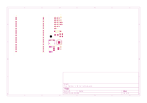

# frambu

## Revisiones

- `v-0-rev-a`: en diseño, única revisión presente en el repositorio.

## Esquemático y placa (v-0-rev-a)

Generados automáticamente por GitHub Actions a partir de `frambu-v-0-rev-a/frambu-v-0-rev-a.kicad_sch` y `.kicad_pcb` en cada push que los modifica.

## Bill of materials (v-0-rev-a)

Generado a partir de `frambu-v-0-rev-a/frambu-v-0-rev-a.kicad_sch`. No confundir con `frambu-v-0-rev-a/bom.csv`, que se escribe a mano para generar la biblioteca local.

<!-- BOM_TABLE_START -->

| Referencias | Cantidad | Valor | Huella | LCSC | Descripción |
| --- | --- | --- | --- | --- | --- |
| C1, C9 | 2 | 1u | Capacitor_SMD:C_0805_2012Metric | *(sin código)* | Condensador |
| C2, C3, C4, C5, C6, C7, C8, C10, C11 | 9 | 100n | Capacitor_SMD:C_0805_2012Metric | *(sin código)* | Condensador |
| C12, C18 | 2 | 100u | frambu-v-0-rev-a:C1206 | C15008 | Condensador |
| C13, C19, C20 | 3 | 10u | frambu-v-0-rev-a:C0402 | C15525 | Condensador |
| C15 | 1 | 10u | Capacitor_SMD:CP_Elec_4x5.4 | *(sin código)* | Condensador |
| C16, C17 | 2 | 15p | *(sin huella asignada)* | *(sin código)* | Condensador |
| J3, J4 | 2 | Conn_02x18_Odd_Even | Connector_PinSocket_2.54mm:PinSocket_1x20_P2.54mm_Vertical | *(sin código)* | Conector de pines |
| J5 | 1 | USB_C_Receptacle_USB2.0_16P | frambu-v-0-rev-a:USB-C_SMD-TYPE-C-31-M-12_1 | C165948 | Conector USB-C |
| R1, R2 | 2 | 27.4 | *(sin huella asignada)* | *(sin código)* | Resistencia |
| R3 | 1 | 1k | Resistor_SMD:R_0805_2012Metric | C11702 | Resistencia |
| R4 | 1 | 10k | frambu-v-0-rev-a:R0402 | C25744 | Resistencia |
| R5 | 1 | 1K | Resistor_SMD:R_0805_2012Metric | *(sin código)* | Resistencia |
| R6, R7 | 2 | 5k1 | frambu-v-0-rev-a:R0402 | C25905 | Resistencia |
| SW1 | 1 | PTS 636 | frambu-v-0-rev-a:KEY-SMD_L6.0-W3.5-LS8.7 | C2689642 | Botón BOOTSEL |
| U1 | 1 | RP2040 | Package_DFN_QFN:QFN-56-1EP_7x7mm_P0.4mm_EP3.2x3.2mm | *(sin código)* | Microcontrolador RP2040 |
| U2 | 1 | AMS1117-5.0 | Package_TO_SOT_SMD:SOT-223-3_TabPin2 | C880752 | Regulador lineal (LDO) |
| U3 | 1 | W25Q128JVS | frambu-v-0-rev-a:SOIC-8_L5.3-W5.3-P1.27-LS8.0-BL | C97521 | Memoria flash QSPI de 128 Mbit |
| U4 | 1 | SGTL5000XNLA3 | Package_DFN_QFN:QFN-20-1EP_3x3mm_P0.4mm_EP1.65x1.65mm | *(sin código)* | Audio:SGTL5000XNLA3 |
| Y1 | 1 | Crystal_GND24 | *(sin huella asignada)* | *(sin código)* | Cristal |

35 componentes en total. Los ítems marcados *(sin huella asignada)* todavía no están completos en el esquemático — hay que completarlos antes de generar gerbers o comprar partes para esta revisión.

<!-- BOM_TABLE_END -->
